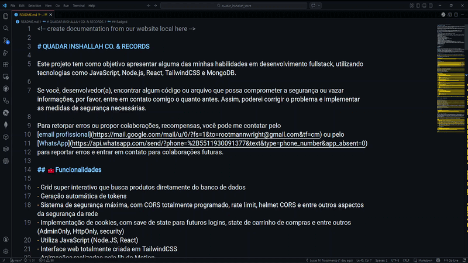

<!-- create documentation from our website local here -->

# QUADAR INSHALLAH CO. & RECORDS

Este projeto tem como objetivo apresentar alguma das minhas habilidades em desenvolvimento fullstack, utilizando tecnologias como JavaScript, Node.js, React, TailwindCSS e MongoDB.

Se você, desenvolvedor(a), encontrar algum código ou arquivo que possa comprometer a segurança ou vazar informações, por favor, entre em contato comigo o quanto antes. Assim, poderei corrigir o problema e implementar as medidas de segurança necessárias.

Para retorpar erros ou propor colaborações, recompensas, você pode me contatar pelo
[email profissional](https://mail.google.com/mail/u/0/?fs=1&to=rootmannwright@gmail.com&tf=cm) ou pelo
[WhatsApp](https://api.whatsapp.com/send/?phone=%2B5511930091377&text&type=phone_number&app_absent=0)
para reportar erros e entrar em contato para colaborações futuras.

## 🧰Funcionalidades

- Grid super interativo que busca produtos diretamente do banco de dados
- Geração automática de tokens
- Sistema de segurança máxima, com CORS totalmente programado, rate limit, helmet CORS e entre outros aspectos da segurança da rede
- Implementação de cookies, com save de state para futuros logins, state de carrinho de compras e entre outros (AdminOnly, HttpOnly, security)
- Utiliza JavaScript (Node.JS, React)
- Interface web totalmente criada em TailwindCSS
- Animações realizadas pela lib do Motion
- Implementação de containers com Docker
- Banco de Dados criado com MongoDB e page admin no Compass
- Testes utilitários com base no JSLint
- Versionamento Git e GitHub
- Implementação de rotas para clusters e deploys futuramente
- Implementação de .env pública e .env de produção
- Utilizado API Stripe e CorreiosAPI para processamento de pagamento e de frete, respectivamente
- Implementação de testes unitários e relatórios com SonarQube, JSLint, K6
- Implementação de GitHub Actions, com automatizações para progress bar automático, segurança do repositório, escaneamento de erros e problemas de segurança no código, dependabot, ferramenta nativa do GitHub, arquivo para futuramente realizar os deploys
- Implementação de hooks

### 📊 Progresso do projeto

<!-- PROGRESS_BAR_START -->
[█████░░░░░] 45%
<!-- PROGRESS_BAR_END -->

## Badged

 
OBS.: Pipeline configurada para ambiente de produção. Deploy será habilitado nas próximas versões.

## 📃Documentação Oficial

Segue abaixo link para nossa documentação oficial para que usuários possam deleitar-se da melhor maneira no nosso site.
 
[Link da documentação oficial](#licenses-e-docs)
 
Enforced in production environment

## 📸Imagens do Projeto

  

 

  

## 🔧Features

| Logo | Tecnologia | Uso |
|------|-----------|-----|
|  | React | Frontend |
|  | Tailwind | UI |
|  | Node.js | Backend |
|  | MongoDB | Database |
 | Docker | Containers |

## 📎Links

[LinkedIn](https://www.linkedin.com/in/lucasmarquesdev/)
 
[Instagram](https://www.instagram.com/homiemannwright)
 
[Linktree](https://linktr.ee/patrondev)
 
[GitHub](https://github.com/rootmannwright)

## 🙏 Agradecimentos

<table align="center">
  <tr>
    <td align="center" width="150">
      
       
      <strong>Omer fils ELENGA</strong>
       
      Exemplos de about e video frame
    </td>
    <td align="center" width="150">
      
       
      <strong>Andrew</strong>
       
      Layouts e UI com Tailwind e button
    </td>
    <td align="center" width="150">
      
       
      <strong>Tanvir Hasan Bappy (Tanvir)</strong>
       
      Arquitetura carrinho de compras
    </td>
  </tr>
  <table align="center">
  <tr>
    <td align="center" width="150">
      
       
      <strong>Amine Ghanim</strong>
       
      Exemplos de login
    </td>
</table>

Agradeço a todos os colaboradores do fórum da página <em>TailwindFlex</em>.  Todos os direitos reservados.

[TailwindFlex](https://tailwindflex.com/)

## 📃Licenses e Docs

[MIT](https://mit-license.org/)
 
[Framer Motion](https://motion.dev/docs)
 
[React](https://pt-br.legacy.reactjs.org/)
 
[NodeJS](https://nodejs.org/docs/latest/api/)
 
[MongoDB](https://www.mongodb.com/pt-br/docs/)
 
[Docker](https://docs.docker.com/?_gl=1*1neua0k*_gcl_au*MTg0MjY5MzMwMi4xNzY4NzE5Njk5*_ga*MTk2ODA4NzE2MC4xNzY4NzE5Mzk4*_ga_XJWPQMJYHQ*czE3NzE4MjQzMzEkbzkkZzEkdDE3NzE4MjQzMzgkajUzJGwwJGgw)
 
[Helmet](https://www.npmjs.com/package/helmet)
 
[K6](https://k6.io/)

## 👥 Contribuidores

  <a href="https://github.com/rootmannwright">
     
    <strong>Lucas Marques</strong>
  </a>
   
  Backend / Frontend / Banco de Dados

Dedico todo o tempo que investi neste projeto principalmente aos meus pais, que sempre cuidaram de mim, eduracam-me e tornaram-me o homem que sou, todas as experiências que desenvolvi, que adquiri; também para todos os meus professores que sempre me motivaram a estudar e tornar-me uma pessoa socialmente informada; para todos os meus colegas de trabalho, todos os contribuintes que me ajudaram nesse projeto, tanto diretamente quanto indiretamente; todos os fóruns e, principalmente, desenvolvedores individuais, que em breve farei uma área especial neste repositório.

 
Sem vocês, este projeto não teria retomado a vida e a proporção que a marca venho conquistando.

<table>
  <tr>
    <td width="50%">
      <h3>🛍️ Lucas M. Nascimento - @rootmannwright</h3>
      

        Desenvolvedor Fullstack, com ênfase em Backend. Atualmente fundou e atua, como diretor executivo das marcas <em>Quadar Inshallah Co. & Records</em> e sua trademark <em>Quadar Inshallah Headshop™</em>.
      

      

        <b>Tecnologias:</b> React • Node.js • MongoDB • TailwindCSS • JWT • Docker • JavaScript • TypeScript • PHP • MySQL • Kubernetes • Amazon AWS • Java • Java SpringBoot • Pentester • SHODAN • Wireshark • NMAP • Kali Linux • CLI Terminal (Windows e Linux).
      

      <a href="https://github.com/rootmannwright/">
        🔗 Ver repositório
      </a>
    </td>
    <td width="50%">
      
      <!-- add image preview into project -->
    </td>
  </tr>
</table>

